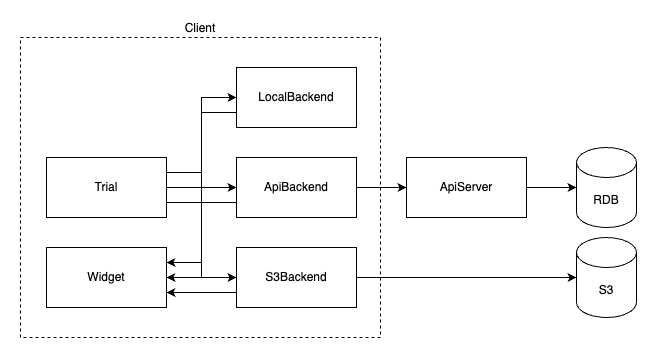
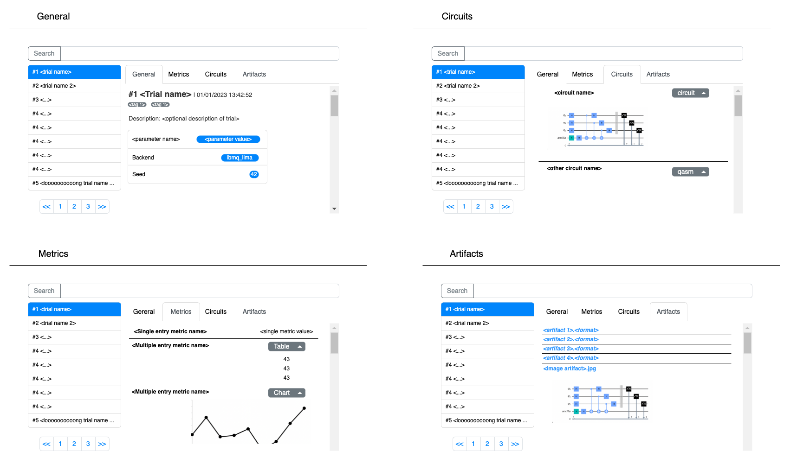

# Summary

PurpleCaffeine aims to provide researchers in the field of quantum computing
with a user-friendly and efficient solution for tracking their 
experimentation data. With the rapid advancement of quantum 
computing research, the need for accessible and organized data 
management tools has become increasingly important. By offering 
a simplified interface, the package allows researchers to easily 
record and organize quantum experimental data, ensuring its accessibility
and facilitating future analysis.

By utilizing this package, researchers can effortlessly capture and 
store crucial information related to their quantum experiments. The 
user-friendly interface simplifies the process of inputting and 
organizing data, including experimental parameters, measurement 
results, quantum circuits, OpenQASM files, devices information and other
relevant metadata. The package's emphasis on simplicity 
reduces the learning curve and frees researchers from complex data 
management tasks, enabling them to focus on their core work. 

# Statement of need

Researchers in the field of quantum computing predominantly rely on 
notebook services, such as Jupyter, to work within an interactive 
coding environment. While this approach offers numerous benefits, 
including code experimentation and real-time analysis, it presents 
a significant challenge when it comes to tracking experimental data. 
One of the main drawbacks is the constant overwriting of data, 
making it exceedingly difficult to trace the specific parameters, 
circuits, and other details utilized in previous iterations.

As quantum computing research progresses, it becomes increasingly 
important to have a reliable and efficient system for managing 
experimental data. A comprehensive solution is needed to address 
the shortcomings of interactive workflows, ensuring that researchers
can easily record and access vital information related to their experiments.
By overcoming the limitations of current approaches, this solution
would empower researchers to track their data effectively and gain
valuable insights from previous iterations, leading to more accurate 
analyses, reproducible research, and accelerated progress in the field.

# Architecture

The proposed software package utilizes a variation of the client-server 
architecture, consisting of a client-side component and multiple storage 
options for storing experimental data \autoref{fig:architecture}.

The client component is a Python library specifically designed for 
tracking experimental data in quantum computing research, covering essential
Qiskit [@Qiskit] objects like QuantumCircuit, Operators, Backends, etc.

To cater to diverse needs, the package provides three flavors of storage 
options for storing experimental data:
1. Local Storage: The local storage allows researchers to store 
    their experimental data locally on their machines. 
    This option offers convenience and data privacy, as 
    researchers have direct control over their data storage. 
    It is an excellent choice for individual researchers or 
    small-scale projects where data sharing and collaboration 
    are not a primary concern. 
2. API Storage: The API storage is a RESTful API service that  
    functions as a multi-tenant storage solution. 
    Researchers can utilize this storage to store their experimental 
    data in a centralized and scalable manner. 
    It is particularly beneficial for collaborative research projects or 
    environments where data sharing and team collaboration are essential. 
3. S3 Storage: The S3 storage provides the option to store experimental 
    data in S3 buckets, which are highly scalable and reliable storage 
    containers. Researchers can leverage the power and versatility of 
    S3 to securely store and access their experimental data. 
    This option is ideal for projects that require large-scale data storage
    and long-term data retention.

# Functionality

The functionality of the software package revolves around the Python client, 
which serves as the primary interface for interacting with the software. 
Through the client, researchers can access and utilize three key abstractions 
that cover the entire experimentation tracking workflow:

1. Trial: The Trial class is a fundamental abstraction provided by the software. 
Researchers use this class to define and specify the experimental metadata 
they want to gather and track. It acts as a blueprint for capturing information 
such as experimental parameters, circuit configurations, measurement results, 
and any other relevant data points.

2. Storage: The Storage abstraction is responsible for the storage functionality 
of the software. It provides a unified interface to store and retrieve experimental 
data. The software offers three different flavors of storage options, as previously
discussed: local storage, API storage, and S3 storage.

3. Widget: The Widget \autoref{fig:widget} is a visualization tool that enhances the user experience by acting 
as a user interface for searching, viewing, and analyzing previous trials. 
This widget is specifically designed to integrate with Jupyter notebooks, 
providing a convenient and interactive environment for researchers.

# Acknowledgements

We would like to express our sincere gratitude to the Qiskit Advocates Mentorship 
Program (QAMP) [@qamp] that played a role in bringing together the talented team behind 
the development of this software package. The mentorship program provided a valuable 
platform for fostering collaboration, learning, and professional growth.

# References